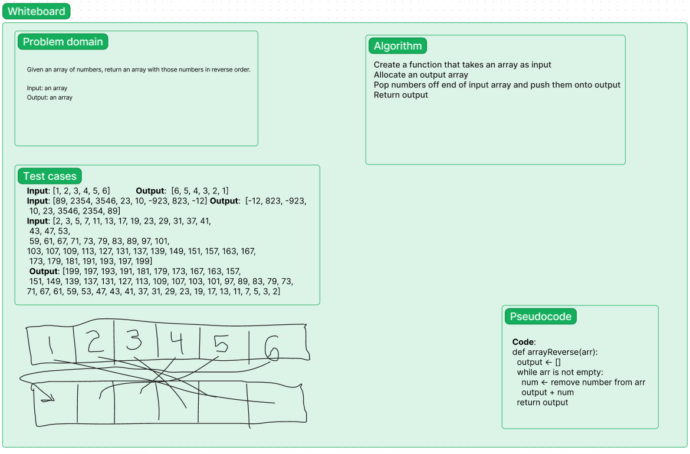

# Description

This is a whiteboard showing my understanding of how to reverse an array. It uses an additional array to take the reversed elements.

# Whiteboard

# Approach

I used an output array that pushes the popped elements of the input onto the end. Arrays/vectors are optimized for such insertions and deletions, and using a storage array has the manageable downside of requiring O(2n) space instead of O(n), but I think returning new values/objects is the superior method overall. I could potentially improve this by not modifying the input object, but I then might have to loop over it, which is an O(n) time complexity operation, compared to the constant time nature of both pushing and popping from arrays. 