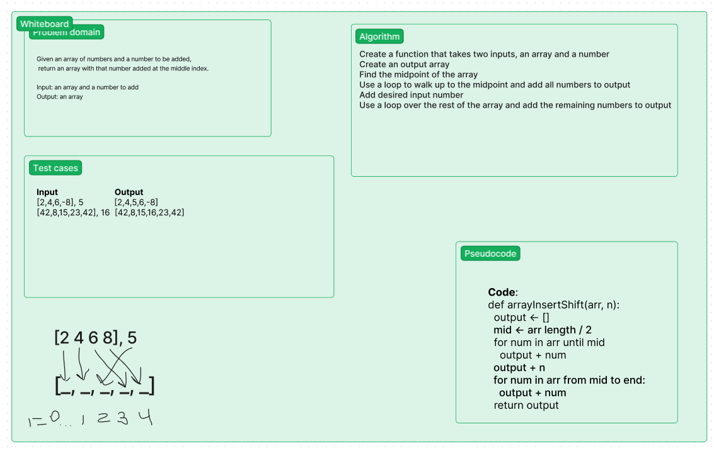

# Description

This is a whiteboard showing a method for inserting a number at the middle of an array by shifting the elements. It uses an additional array.

# Whiteboard

# Approach

I allocated an extra array because it is difficult to do in-place insertions like this. The algorithm in question iterates through the first half of the array, adding the elements, then stopping. It adds the desired number passed in as input before the loop is restarted and the remaining elements from the input array are added to the output array.