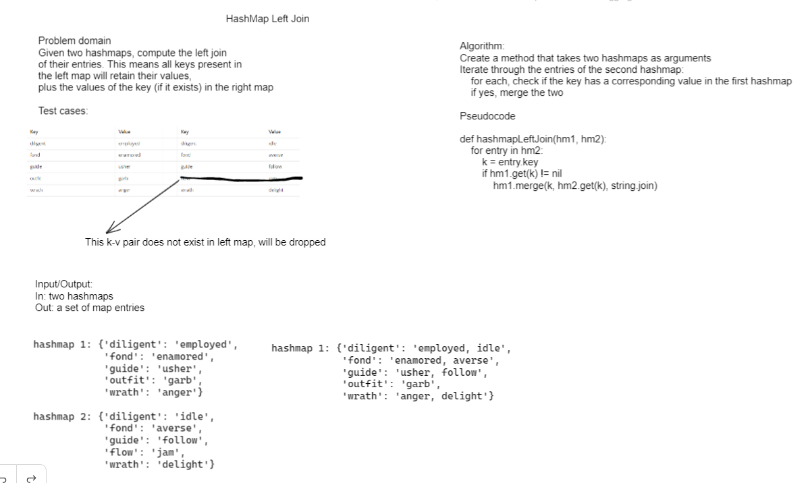

# README

## Hashmap left join

This class implements a left-join merge of two hashmaps. The keys in the left map are retained always; the keys in the right are only added to the left if they exist in the right. The values in the left are merged with the corresponding values in the left in this case only

## API

This class has a single static method `leftJoin`. It takes two `java.util.HashMap` as arguments and returns a `java.util.Set` of their merged entries.

## Performance characteristics

This method requires `O(n)` time complexity to iterate over the right hashmap. It requires `O(n)` space complexity because the set returned from the method necessitates an additional allocation.

