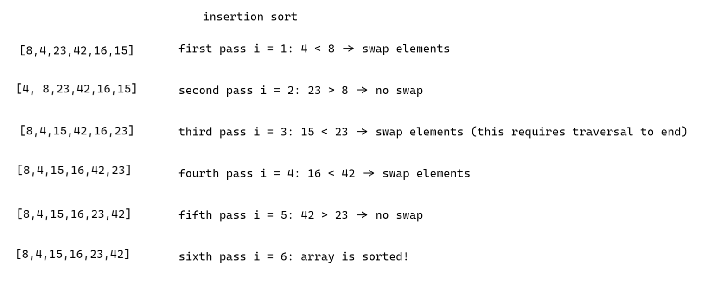

# Insertion Sort

Insertion sort is a basic algorithm for sorting sequential data. It is not very efficient, but it is easy to understand, so it presents a good opportunity to break down its implementation and visualize a bit.

Given a sequence, like a Java list, an insertion sort implementation will traverse the list from left to right, using three pointers. Two pointers `i` and `j` will hold references to adjacent elements, and a third `temp` (or whatever other names the programmer picks), will hold a reference to the element to be moved.

If an element is less than the element to its left, they will be swapped. This means that an element that is greater than several sequential elements (going left) must be swapped into its correct position before iteration can continue. This is the core explanation for the inefficiency of insertion sort, as in the worst case, an element at the end of the sequence can be smallest in value.

Visualization:

